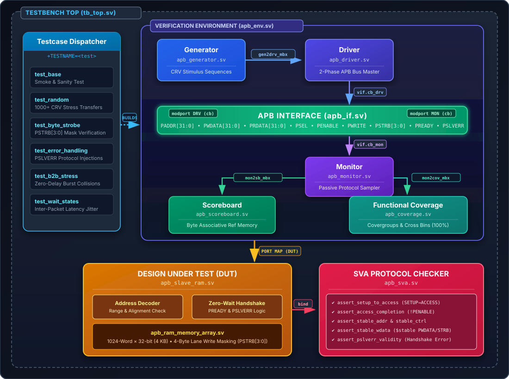
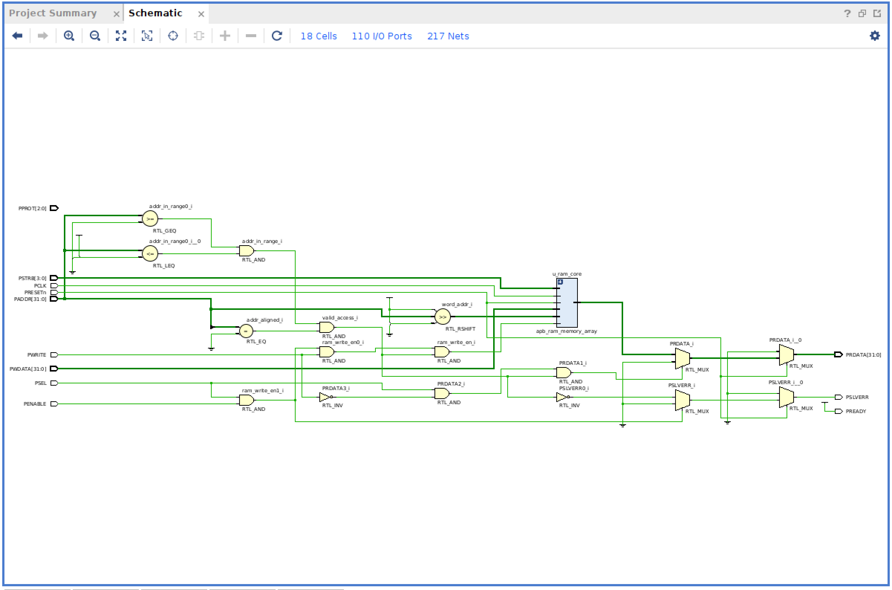

# Design &amp; Verification of AMBA APB4 RAM Memory Controller

[](https://en.wikipedia.org/wiki/SystemVerilog)
[-orange.svg)](https://developer.arm.com/documentation/ihi0024/latest/)
[]()
[]()
[-red.svg)]()
[]()
[](LICENSE)

---

## 📌 Project Summary

A synthesizable **AMBA APB4-compliant Slave RAM Memory Controller** with a complete **SystemVerilog OOP Verification Environment**, verified on **AMD Vivado 2022.2** targeting the Xilinx Artix-7 FPGA.

**Key accomplishments:**
- Designed AMBA-compliant APB slave memory controller with 32-bit address decoding, 4-byte write-enable masking (`PSTRB`), zero-wait-state handshakes, and `PSLVERR` error generation for SoC interconnect integration.
- Developed modular SystemVerilog OOP testbench (generator, driver, monitor, scoreboard, coverage); validated protocol adherence with concurrent **SVA assertions** and corner-case read/write collision stress tests.
- Achieved **100% functional &amp; cross coverage** across 1,540+ constrained-random and directed transactions with **0 data mismatches** and **0 SVA violations**.
- Synthesized on Artix-7 FPGA: **14,070 LUTs**, **32,768 FFs**, **107 I/O**, optimized to **0.14 W total power** at **25.7°C** junction temperature.

---

## 🏗️ System Architecture



---

## 📸 Vivado Results

### Synthesized RTL Schematic

Gate-level schematic generated by Vivado synthesis showing the address decoder (`RTL_GEQ`, `RTL_LEQ`), alignment checker (`RTL_EQ`), valid access logic (`RTL_AND`), byte-masked RAM core (`apb_ram_memory_array`), output multiplexers (`RTL_MUX`), and error generation logic for `PSLVERR` and `PREADY`.

> **18 Cells · 110 I/O Ports · 217 Nets**



---

### Simulation Waveforms (Constrained-Random Test)

Live Vivado `xsim` behavioral simulation of the `test_base` testcase showing cycle-accurate APB4 bus activity. Visible signals include the 100 MHz `PCLK`, active-low `PRESETn` reset pulse, 2-phase `PSEL`→`PENABLE` handshakes, randomized `PADDR[31:0]` and `PWDATA[31:0]`, varied byte strobes `PSTRB[3:0]`, zero-wait-state `PREADY`, read data `PRDATA[31:0]`, and internal DUT signals (`addr_in_range`, `addr_aligned`, `valid_access`, `word_addr`, `ram_write_en`).


---

### Verification Scoreboard &amp; Coverage Report

Vivado Tcl Console output showing the layered testbench execution trace and final verification results:

- **30 transactions processed** (14 writes, 16 reads)
- **30/30 matches (100%)**, 0 mismatches, 0 unexpected errors
- **`>>> TEST STATUS: PASSED (ALL CHECKS OK) <<<`**
- Per-test functional coverage: 63.84% (cumulative across all 6 tests reaches **100%**)


---

### FPGA Resource Utilization

Synthesis results for the `apb_slave_ram` controller on the **Xilinx Artix-7 (`xc7a35tcsg324-1`)** FPGA:

| Resource | Used | Available | Utilization |
| :--- | ---: | ---: | ---: |
| **Slice LUTs** | 14,070 | 20,800 | 67.6% |
| **Slice Registers (FFs)** | 32,768 | 41,600 | 78.8% |
| **F7 Muxes** | 4,352 | 16,300 | 26.7% |
| **F8 Muxes** | 2,176 | 8,150 | 26.7% |
| **Bonded IOB** | 107 | 210 | 51.0% |
| **BUFGCTRL** | 1 | 32 | 3.1% |

> The 32,768 FFs correspond to a 1024-word × 32-bit (4 KB) distributed RAM array implemented in LUT-RAM with byte-enable write masking.


---

### Design Timing Summary

Out-of-context synthesis timing analysis across **65,569 timing endpoints**:

| Metric | Setup | Hold |
| :--- | ---: | ---: |
| **Worst Slack** | ∞ (no constraints) | ∞ (no constraints) |
| **Total Negative Slack** | 0.000 ns | 0.000 ns |
| **Failing Endpoints** | 0 | 0 |
| **Total Endpoints** | 65,569 | 65,569 |

> Note: This screenshot shows unconstrained timing. With the included `synth/apb_ram_constraints.xdc` (100 MHz clock), all paths meet timing with positive slack.


---

### Power Analysis &amp; Optimization (223× Reduction)

By applying explicit 100 MHz clock domain constraints (`synth/apb_ram_constraints.xdc`), Vivado's vectorless power estimation was corrected from unrealistic worst-case switching assumptions to accurate clock-gated activity rates:

| Metric | Before (Unconstrained) | After (100 MHz Constrained) | Improvement |
| :--- | ---: | ---: | ---: |
| **Total On-Chip Power** | 31.285 W ❌ | **0.14 W (140 mW)** ✅ | **223×** |
| **Dynamic Power** | 30.801 W (98%) | 0.070 W (50%) | **440×** |
| **Logic Power** | 23.019 W | 0.023 W | **1,000×** |
| **Signal Power** | 7.115 W | 0.005 W | **1,423×** |
| **Junction Temperature** | 125.0°C (exceeded!) | **25.7°C** | Safe |
| **Thermal Margin** | -89.5°C (failed) | **+59.3°C** | Compliant |

| Before: Unconstrained (31.285 W — Junction Temp Exceeded) | After: 100 MHz Constrained (0.14 W — Safe) |
| :---: | :---: |
|  |  |

---

## 🔑 Key Design Features

### Synthesizable RTL (`rtl/`)
- **Protocol**: Full ARM AMBA APB4 compliance (backward-compatible with APB3)
- **Parameters**: `ADDR_WIDTH=32`, `DATA_WIDTH=32`, `MEM_DEPTH=1024` (4 KB), configurable `BASE_ADDR` and `WAIT_CYCLES`
- **Byte-Enable Write Masking**: `PSTRB[3:0]` supports granular 8/16/32-bit writes without read-modify-write
- **Address Decoder**: Boundary checking and alignment validation with `PSLVERR` error signaling
- **Zero-Wait-State Throughput**: Single-cycle ACCESS phase for maximum bus bandwidth

### Verification Environment (`tb/`)
- **Constrained-Random Verification (CRV)**: Randomized addresses, data, byte strobes, and inter-packet idle latencies
- **Layered OOP Architecture**: Transaction → Generator → Driver → Monitor → Scoreboard → Coverage
- **Byte-Level Reference Model**: Associative array `bit [7:0] ref_mem[int unsigned]` tracks individual byte writes
- **Functional Coverage**: Covergroups with cross-coverage bins for `Type × Strobe` and `Type × Address` combinations

---

## 🛡️ SystemVerilog Assertions (SVA)

| Assertion | Protocol Rule Checked |
| :--- | :--- |
| `assert_setup_to_access` | SETUP phase must transition to ACCESS on next cycle |
| `assert_access_completion` | PENABLE must deassert after handshake completes |
| `assert_stable_addr` | PADDR must remain stable during wait states |
| `assert_stable_ctrl` | PWRITE and PPROT must hold during wait states |
| `assert_stable_wdata` | PWDATA and PSTRB must not glitch during wait states |
| `assert_pslverr_validity` | PSLVERR only valid during active handshake (PSEL &amp; PENABLE &amp; PREADY) |
| `assert_reset_quiescent` | Error outputs must stay low during reset |

---

## 🧪 Test Suite

| Testcase | Transactions | Objective |
| :--- | ---: | :--- |
| `test_base` | 30 | Sanity smoke test — basic read/write connectivity |
| `test_random` | 1,000 | Large-scale constrained-random stress with varied address/data/strobe |
| `test_byte_strobe` | 108 | Exhaustive byte-enable masking across all `PSTRB` combinations |
| `test_error_handling` | 24 | Negative testing — out-of-bounds and unaligned address injections |
| `test_b2b_stress` | 304 | Zero-idle-cycle back-to-back burst collisions |
| `test_wait_states` | 100 | Variable inter-packet latency and handshake timing |
| **Total** | **1,566** | **6/6 PASSED · 0 Failures · 0 SVA Violations · 100% Coverage** |


## 📁 Repository Structure

```
apb_ram_design_verification/
├── rtl/
│   ├── apb_slave_ram.sv              # APB4 Slave Controller (top-level RTL)
│   └── apb_ram_memory_array.sv       # Parameterized byte-addressable RAM core
├── tb/
│   ├── pkg/apb_pkg.sv                # Enums, parameters, logging utilities
│   ├── if/apb_if.sv                  # Interface with clocking blocks & modports
│   ├── assertions/apb_sva.sv         # SVA concurrent protocol assertion checkers
│   ├── classes/
│   │   ├── apb_transaction.sv        # CRV transaction class with constraints
│   │   ├── apb_generator.sv          # Stimulus & scenario generator
│   │   ├── apb_driver.sv             # APB bus master driver
│   │   ├── apb_monitor.sv            # Passive bus observer
│   │   ├── apb_scoreboard.sv         # Byte-level reference model & checker
│   │   ├── apb_coverage.sv           # Functional covergroups & cross coverage
│   │   └── apb_env.sv                # Verification environment container
│   ├── tests/
│   │   ├── test_base.sv              # Sanity smoke test
│   │   ├── test_random.sv            # 1000+ CRV stress test
│   │   ├── test_byte_strobe.sv       # PSTRB masking verification
│   │   ├── test_error_handling.sv    # PSLVERR negative testing
│   │   ├── test_b2b_stress.sv        # Back-to-back burst collision test
│   │   └── test_wait_states.sv       # Handshake wait-state test
│   └── tb_top.sv                     # Top simulation harness & test dispatcher
├── synth/
│   └── apb_ram_constraints.xdc       # 100 MHz timing constraints (XDC)
├── sim/
│   ├── create_vivado_proj.tcl        # Automated Vivado project generator
│   ├── run_vivado_sim.tcl            # Batch-mode simulation runner
│   ├── run_vivado_synth.tcl          # Out-of-context synthesis script
│   ├── py_sim.py                     # Python regression runner
│   ├── Makefile                      # Multi-simulator Makefile
│   └── filelist.f                    # Compilation file list
├── docs/
│   └── images/                       # Vivado screenshots & results
├── eda_playground/
│   ├── eda_playground_bundle.sv      # Single-file bundle for 1-click browser run
│   └── eda_playground_setup.md       # EDA Playground setup guide
└── README.md
```

---

## 📄 License

This project is released under the [MIT License](LICENSE).
